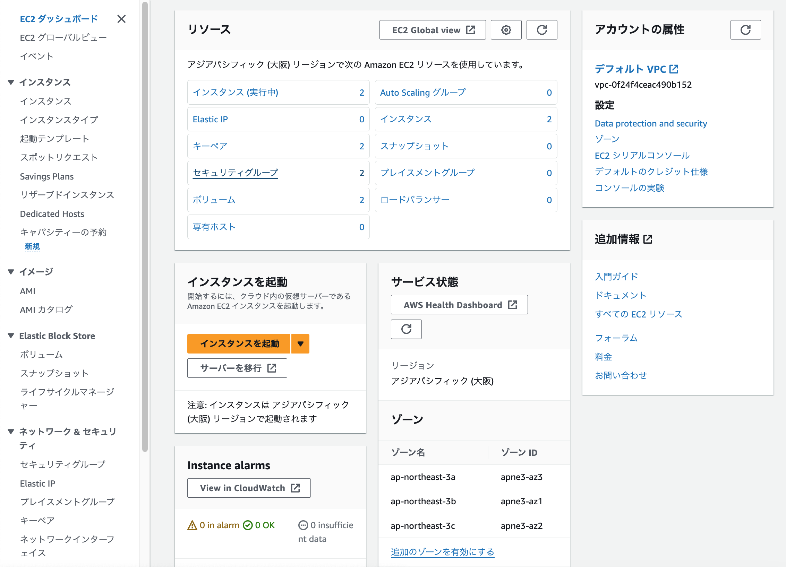
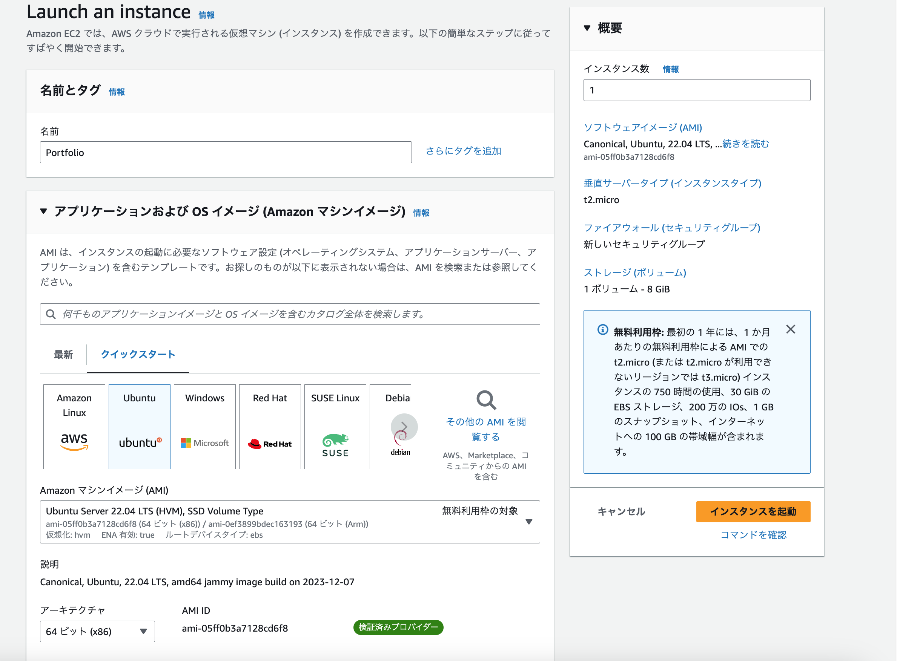
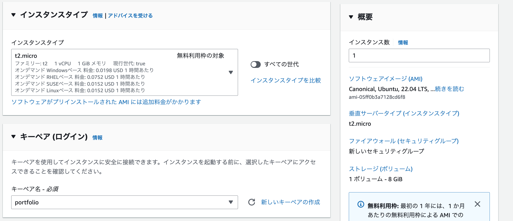
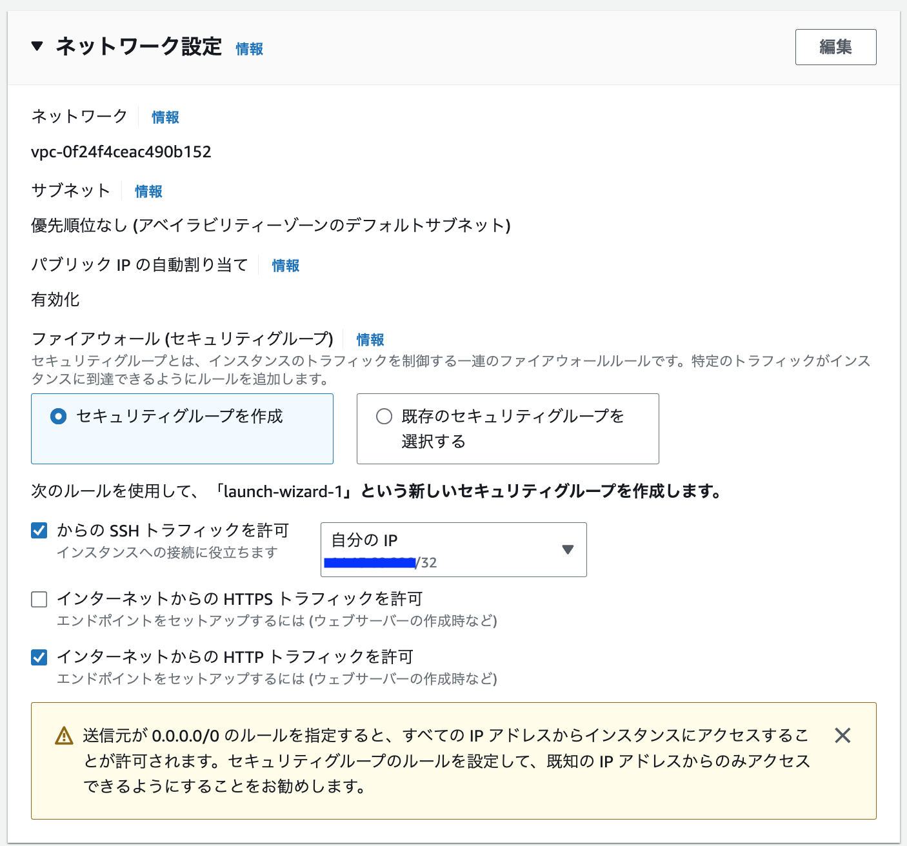
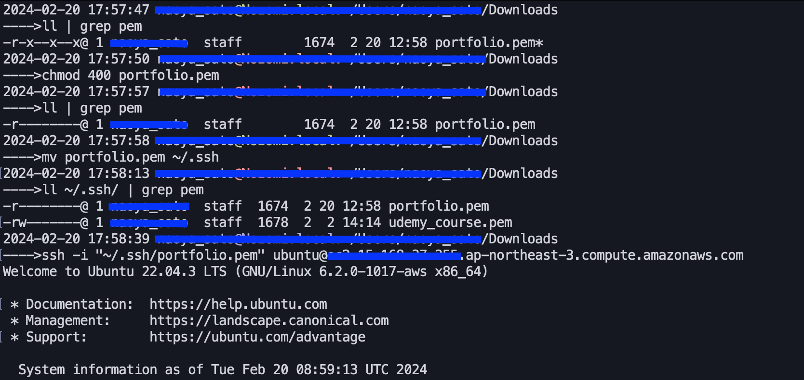
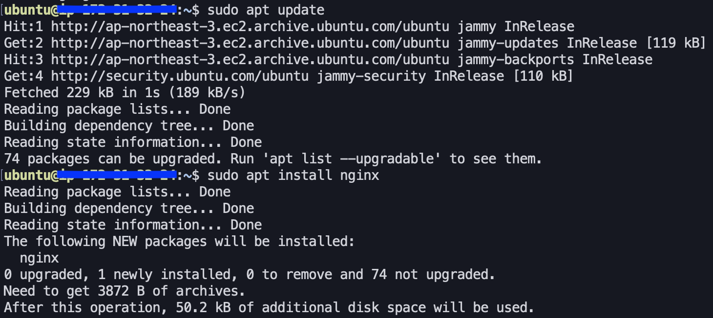
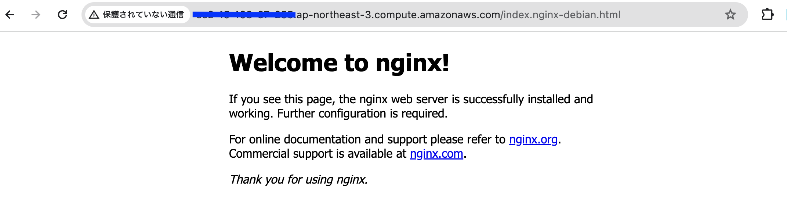

# ポートフォリオサーバーを設定しよう

本稿では、当サイトのサーバー側の設定手順を記載している。

## 0.前提条件

* AWSのアカウントを取得していること。
* AWSのセキュリティ対策として、IAMや多要素認証をしていること。
* 本稿では Mac mini(2023)(macOS Sonoma 14.3.1) を使用する。
* 構成は以下の通り
  * AWS EC2 にて、Ubuntu 20.04 LTS のインスタンスを作成する。
  * Web サーバーアプリケーションには Nginx を使用する。
  * 作成したページは2枚(ポートフォリオとなる `index.html` と、本稿 `/howto/infra/no1_construction/index.html`)

## 1. EC2 インスタンスを起動する

### 1-1. EC2 インスタンスを作成する

AWS にルートユーザーでサインインし、AWS の画面左上の検索窓で「EC2」と入力して、EC2 ダッシュボードを開く。画面中央部の「インスタンスを起動」という橙色のボタンを押下する。



画面中央の「クイックスタート」で Ubuntu を選択する。Amazon マシンイメージ(AMI) は、今回の使用環境であり、かつ、無料利用枠の対象(※1)でもある、「Ubuntu Server 20.04 LTS (HVM), SSD Volume Type 」を選択する。アーキテクチャは、64ビット (Arm)を選択すると、無料利用枠の対象(※1)でなくなるため、64ビット (x86)のままにしておく。

※1 2024/2/20 時点





上図「ファイアウォール(セキュリティグループ)」では、「セキュリティグループを作成」「自分の IP」を選択し(※2)、「からの SSH トラフィックを許可」「インターネットからの HTTP トラフィックを許可」にチェックを入れる。

※2 HTTP アクセスに関しては、公開するタイミングで設定を変更する。

### 1-2. キーペアの作成

起動するインスタンスに SSH でアクセスするため、キーペアを作成する。任意の名前をつけて、キーペアをダウンロードする。


### 1-3. インスタンスの起動

以上が完了したあと、「インスタンスの起動」ボタンを押下し、インスタンスを起動する。

### 1-4. ターミナルからリモート接続

ターミナルを開き、1-2. キーペアの作成 にて作成したキーペアを、 `~/.ssh` ディレクトリ配下に移動させる。ディレクトリがなければ作成する。
「インスタンスに接続」>「SSH クライアント」と画面遷移すると、以下のような接続手順が記されている。

1. SSH クライアントを開く。
2. プライベートキーファイルを見つける。このインスタンスの起動に使用されるキーは `xxx.pem`
3. 必要に応じて、以下のコマンドを実行して、キーが公開されていないことを確認する。`chmod 400 "xxx.pem"`
4.パブリック DNS を使用してインスタンスに接続
例: `ssh -i "xxx.pem" ubuntu@(割り当てられたパブリック IPv4 DNS)`

この手順に従って、SSH での接続を試みる。



## 2. Nginx をインストールする

### 2-1. Nginx のインストール

Web サーバー用のソフトとして、Nginx を選択する。本稿の執筆時点で、Web サイトの用途は HTML を1ページ表示するにとどまり、ここからサイトをどのような方向性で展開していくか決めかねているため、一旦、直近で学習した Nginx の復習がてら、設定をしていく。また、Nginx の方がメモリの使用量が少ないため、EC2 の無料枠を使用している状況下にも向いていると考えた。

以下のコマンドを実行して、Nginx をインストールする。

```shell
sudo apt update
sudo apt install nginx
```



一度、インストールに成功しているか、ブラウザで確認する。`http://(コピーした IP アドレス)` にアクセスして、以下のような画面が表示されていればよい。



### 2-2. 作成した HTML の転送

　作成したHTML をEC2 インスタンスに配置し、公開する。以下のコマンド( SSH 接続に使ったものの `ssh` を `sftp` に置き換えたもの)でログインできる。

```shell
sftp -i "~/.ssh/xxx.pem" ubuntu@(割り当てられたパブリック IPv4 DNS)
```

SFTP では、`cd` や`ls` などのコマンドが使えるため、それを利用して、ドキュメントルートの`/var/www/html` にリモートのカレントディレクトリを移動させ... たいところだが、EC2 のユーザーまわりの設定がそのままだと、ドキュメントルートへのパーミッションがないのか、`Permission Denied.` が発生してしまう。そのため、一旦、`/home/ubuntu` 下に転送用の一時的なディレクトリ`temp` を作成し、そこから再度 SSH でログインして、`mv` コマンドで移動させるようにする。

　また、`lcd` や`lls` など、通常のコマンドに`l` をつけることで、ローカルの操作が可能となる。これを使い、ローカルのカレントディレクトリを、作成した HTML が置かれている場所に移動させる。

カレントディレクトリの移動が完了したら、ディレクトリの構成が一致するように、mkdir でディレクトリを作成する。Ubuntu では、SFTP の`put` コマンドで、ディレクトリとその配下のファイルを転送できないバグ？があるためである。

　ディレクトリ構成が一致したら、`put` コマンドで各ディレクトリごとに必要なファイルを転送する。

```sftp
> put (ローカルのファイル名) (リモートのディレクトリ名)
```

すべてのファイルの転送に成功したら、SFTP からログアウトし、再度 SSH でログインする。その後、以下のコマンドで、まとめて移動する。

```shell
sudo mv ~/temp/* /var/www/html/
```

再度ブラウザでアクセスすると、以下のように、作成したポートフォリオが表示できるようになった。


## 3. SFTP 専用ユーザーの作成

ここまでの作業で、SFTP でファイルを転送する際の権限まわりに課題が見つかった。よく調査をすると、ユーザーとグループに問題があることが分かった。

### 3-1. SFTP 専用ユーザーとグループの設定

まず、SFTP 専用ユーザーを作成する。

```shell
sudo adduser [ユーザー名]
```

次に、SFTP 専用ユーザーを、Nginx や Apache などで、公開用のグループとして設定されることが多い `www-data` に変更する。グループ `www-data` を作成後、`usermod` コマンドにより、主グループを変更する。主グループを `www-data` に変更することで、`put` コマンドでアップロード後、`chown` でグループの修正をすることなく、そのまま公開することができる。

```shell
sudo groupadd www-data
sudo adduser [ユーザー名] www-data
sudo usermod -g www-data [ユーザ名]
```

### 3-3. 認証鍵の設定

ローカルでログインするための鍵を、ここで生成しておく。

```shell
su [ユーザー名]
ssh-keygen
```

`ssh-keygen` により、秘密鍵 `id_rsa` と、公開鍵 `id_rsa.pub` が生成される。

公開鍵の名前を `authorized_keys` にしておき、パーミッションを600に変更する。

```shell
sudo mv id_rsa.pub authorized_keys
sudo chmod 600 authorized_keys
```

また、ローカルに保存する秘密鍵のパーミッションを600に変更する。
ローカルの秘密鍵は、`ホスト名.key` のように、わかりやすい名前をつけておくとよい。

```shell
sudo mv id_rsa [名前] # 任意
sudo chmod 600 [秘密鍵]
```

### 3-4. SFTP 専用ユーザーの SSH 設定

SFTP 専用ユーザーで SFTP 接続した時の設定を編集する。`/etc/ssh/sshd_config` で、`internal-sftp` を使うことで、個別設定が柔軟に行える。

```conf /etc/ssh/sshd_config
#Subsystem sftp /usr/lib/openssh/sftp-server
Subsystem sftp internal-sftp
```

個々の設定は以下の通り。

```conf /etc/ssh/sshd_config
Match User [SFTP 専用ユーザーのユーザー名]
    ChrootDirectory [このユーザーが接続できるディレクトリ]
    X11Forwarding no
    AllowTcpForwarding no
    ForceCommand internal-sftp
```

設定ファイルを編集後、再起動する。

```shell
sudo systemctl restart sshd
```

### 3-5. パーミッションの設定

最後にパーミッションの設定を変更する。チェンジルート(3-4. にて、`ChrootDirectory` で設定)は

**root ユーザーかつ root ディレクトリで、パーミッションは755である必要がある。**

という制約がある。そのため、実際には、チェンジルートの下にディレクトリを作成し、そこに `put` をするような運用となる。

```shell
chown root:root [チェンジルート]
chmod 755 [チェンジルート]
mkdir [put用ディレクトリ]
chown -R root:www-data [put用ディレクトリ]
chmod 775 [put用ディレクトリ]
```

## 4. まとめと今後の展望

今回は、EC2 インスタンスを起動し、Nginx をインストール、作成した HTML ファイルの配置を行った。ドキュメントの作成や、キャプチャの撮影等をしながらの作業のため、正確な所要時間は不明だが、全手順の実行にかかったのは20〜24時間ほどだったと思われる。今後は、作成した Web サイトは HTTP 接続のため、HTTPS 化もしていきたい。そうすると、AWS 環境では、Let’s encrypt を AWS のドメインでは発行できないという、証明書の問題が発生する。そのため、独自ドメインの取得なども視野に入る。

### 4-1. HTTPS 化

2024-03-05に、HTTPS 化が完了。手順は<a href="../no2_https_connection/">こちら</a>。

## 5. 参考文献

* Nginx とは？ Apache との違いについて分かりやすく解説！ (<https://academy.gmocloud.com/qa/20160616/2761> 閲覧日:2024-02-21, 更新日:2016-06-16)
* Ubuntu18 チェンジルート付きでSFTPユーザーの追加 (<https://heppoko-room.net/archives/1834> 閲覧日:2024-02-22, 更新日:2021-12-14)
* LinuxでSFTP専用ユーザーを作成してみた。 (<https://qiita.com/kusano00/items/279eba3531b9c224725b> 閲覧日:2024-02-22, 更新日:2021-02-17)
