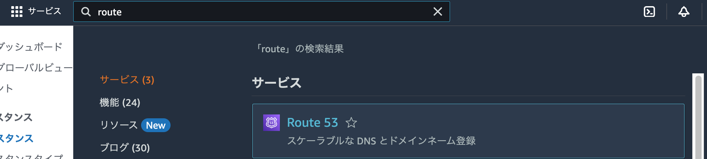

# ポートフォリオサーバーを HTTPS 化しよう<!-- omit in toc -->

<a href=" ../no1_construction/">前回</a>で EC2 によるポートフォリオサーバーの設定が完了した。今回は、前回課題に挙げた「通信を HTTPS 化する」部分をまとめる。

## 目次<!-- omit in toc -->

- [1. Route53 にドメインを紐づける](#1-route53-にドメインを紐づける)
  - [1-1. ドメインを取得する](#1-1-ドメインを取得する)
  - [1-2. ドメインを紐づける](#1-2-ドメインを紐づける)
  - [1-3. ネームサーバーを紐づける](#1-3-ネームサーバーを紐づける)
- [2. Elastic IP の設定](#2-elastic-ip-の設定)
- [3. Elastic IP と Route 53 を紐づける](#3-elastic-ip-と-route-53-を紐づける)
- [4. Let's Encrypt のインストールと設定](#4-lets-encrypt-のインストールと設定)
  - [4-0. はじめに](#4-0-はじめに)
  - [4-1. 必要なパッケージのインストール](#4-1-必要なパッケージのインストール)
  - [4-2. ファイアウォール設定](#4-2-ファイアウォール設定)
  - [4-3. Nginx の設定確認](#4-3-nginx-の設定確認)
  - [4-4. SSL 証明書の取得](#4-4-ssl-証明書の取得)
- [5. 参考文献](#5-参考文献)

## 1. Route53 にドメインを紐づける

### 1-1. ドメインを取得する

筆者はお名前.com でドメインを取得した。サービスによって異なるので、詳細は割愛する。

### 1-2. ドメインを紐づける

AWS にルートユーザーでサインインし、AWS の画面左上の検索窓で「Route 53」と入力して、Route 53 ダッシュボードを開く。



サイドバーまたは画面中央付近の「ホストゾーン」をクリックし、遷移先で「ホストゾーンを作成する」ボタンをクリックする。


以下に必要事項を入力する。基本的にはドメイン名に取得したドメインを記載するのみでよい。


### 1-3. ネームサーバーを紐づける

ホストゾーンの作成が完了後に確認すると、以下のようなレコードの一覧が現れる。タイプ「NS」がネームサーバーであるため、これらの値を控えておく。


上記で控えたネームサーバーのドメインを、ドメインを取得したサービス上で設定する。お名前.com の場合は、以下の通り<br>
「ドメイン設定>ネームサーバー設定>他のネームサーバーを利用」


## 2. Elastic IP の設定

EC2 コンソールにアクセスし、サイドバーの「Elastic IP」をクリックする。


黄色の「Elastic IP アドレスを割り当てる」ボタンをクリックし、初期値のまま「割り当て」ボタンをクリックする。


Elastic IP アドレスの割り当てが完了したことを確認したら、EC2 インスタンスとElastic IP アドレスの関連付けを行う。


## 3. Elastic IP と Route 53 を紐づける

Route 53 ダッシュボードを開き、1. で作成したホストゾーンの詳細を表示する。


上図「レコードを作成」ボタンをクリックし、レコードを作成する。入力値は以下の通り。

- レコード名:設定したい用途にあわせて(未入力可)
- レコードタイプ:A - IPv4 アドレスと一部のAWSリソースに...

- 値:2.で発行した Elastic IP アドレス


設定が完了すると、取得したドメインでページにアクセスすることができる。


また、SSH 接続も取得したドメインでアクセスが可能になる。


## 4. Let's Encrypt のインストールと設定

### 4-0. はじめに

<a href="https://certbot.eff.org/instructions">Certbot</a> 公式によると、snapd という、RedHat や Debian などの系列を横断したパッケージマネージャーを経由してのインストールが最近の一般的な経路となっているようだ。しかし筆者は、どうせ新しいパッケージマネージャーを導入するのであれば、すべてを新しいパッケージマネージャーで管理してしまいたくなる~~完璧主義である~~ ため、今回は、比較的古い方法で行うことにした。

### 4-1. 必要なパッケージのインストール

以下のコマンドで、必要なパッケージをインストールする。

```shell
sudo apt install -y certbot python3-certbot-nginx
```

### 4-2. ファイアウォール設定

次に、ファイアウォールで HTTPS 通信を許可する設定を追加する。AWS EC2 で設定しているため、「EC2>セキュリティグループ>(インスタンスに紐づくセキュリティグループ)」に、以下のようなインバウンドルールを追加する形だと設定しやすい。

- IP バージョン:IPv4
- タイプ:HTTPS
- プロトコル:TCP
- ポート範囲:443
- ソース:0.0.0.0/0(ウィザードで選択する時はAnywhere-IPv4)


### 4-3. Nginx の設定確認

`/etc/nginx/nginx.conf` の `server_name` を取得したドメインに書き換える。以下のように記述する。

```shell
        default_type application/octet-stream;
        server {
                listen       80;
                listen       [::]:80;
                server_name  (取得したドメイン); # ここを修正
                root /var/www/html;
                index index.html;
        }
```

`sudo nginx -t` で、設定ファイルに誤りがないか確認し、`sudo systemctl restart nginx` で Nginx を再起動する。

### 4-4. SSL 証明書の取得

以下のコマンドを入力して、証明書を取得する。

```shell
$ sudo certbot --nginx -d (取得したドメイン)
Saving debug log to /var/log/letsencrypt/letsencrypt.log
Certificate not yet due for renewal

You have an existing certificate that has exactly the same domains or certificate name you requested and isn't close to expiry.
(ref: /etc/letsencrypt/renewal/(取得したドメイン).conf)

What would you like to do?
- - - - - - - - - - - - - - - - - - - - - - - - - - - - - - - - - - - - - - - -
1: Attempt to reinstall this existing certificate
2: Renew & replace the certificate (may be subject to CA rate limits)
- - - - - - - - - - - - - - - - - - - - - - - - - - - - - - - - - - - - - - - -
Select the appropriate number [1-2] then [enter] (press 'c' to cancel): 2
Renewing an existing certificate for (取得したドメイン)

Successfully received certificate.
Certificate is saved at: /etc/letsencrypt/live/(取得したドメイン)/fullchain.pem
Key is saved at:         /etc/letsencrypt/live/(取得したドメイン)/privkey.pem
This certificate expires on 2024-06-03.
These files will be updated when the certificate renews.
Certbot has set up a scheduled task to automatically renew this certificate in the background.

Deploying certificate
Successfully deployed certificate for (取得したドメイン) to /etc/nginx/nginx.conf
Your existing certificate has been successfully renewed, and the new certificate has been installed.

- - - - - - - - - - - - - - - - - - - - - - - - - - - - - - - - - - - - - - - -
If you like Certbot, please consider supporting our work by:
 * Donating to ISRG / Let's Encrypt:   https://letsencrypt.org/donate
 * Donating to EFF:                    https://eff.org/donate-le
- - - - - - - - - - - - - - - - - - - - - - - - - - - - - - - - - - - - - - - -
```

以下のように HTTPS 通信に成功した。


## 5. 参考文献

- Route53を使用してEC2にドメイン名を紐づける(<https://qiita.com/yuichi1992_west/items/e842d8ee50c4afd88775#3-elastic-ip%E3%81%AE%E8%A8%AD%E5%AE%9A>, 閲覧日:2024-03-05, 更新日:2019-12-30)
- Ubuntu 20.04でLet’s Encryptを使用してNginxを保護する方法
(<https://www.digitalocean.com/community/tutorials/how-to-secure-nginx-with-let-s-encrypt-on-ubuntu-20-04-ja>, 閲覧日:2024-03-05, 更新日:2020-10-21)
- 【CentOS stream】nginxでSSL証明書設定！(<https://qiita.com/suzu00091/items/15fda5d80e49cde971e6>, 閲覧日:2024-03-05, 更新日:2021-03-22)
